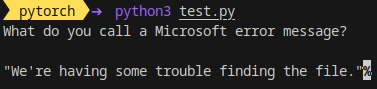

<div align="center">

# LLM Inference using RayServe on Kubernetes

</div>

# BackGround:
Ray is a scalable ML library for python. On Kubernetes, the fundamental object is a RayCluster.

While running on Kubernees, there are three CRDs.

- RayService: Use this for serving/inference of models. This sets up RayCluster and can delete it upon completion. 
- RayJob: Use this for training a model for a one-time task. This sets up RayCluster and can delete it upon completion.
- RayCluster: Set this up if you want to have multiple jobs and you aim to minimize downtime between tasks.

Since we are opting for inference here, we will deploy a RayService.


# Image Creation

Ray has deprecated its RayLLM project, which means that we need to re-create the inference image.

We use vLLM's image as the base image. This already has some components of `ray` installed. But we are interested in the `ray[serve]` package.

Inside the `container` folder, run the following command

```bash
export HF_TOKEN=...
docker build --build-arg HF_TOKEN=$HF_TOKEN -t vllm_openai:ray .
```
Note: gemma is a gated model and hence the need of the `HF_TOKEN`.


To test the model, execute:
```bash
docker run -it --rm --name ray --entrypoint bash --gpus all vllm_openai:ray
```

Inside the container, try these.

```bash
# to test the vllm server
python3 -m vllm.entrypoints.openai.api_server --model google/gemma-2b-it --dtype float16

# to test the rayserve component
serve run main:build_app model="google/gemma-2b-it" dtype=float16
```

# Deployment
To create the inference service,  run

```bash
kubectl apply -f ray-service.yaml
```

To use a different model, simply change the model's name in line 14. 

# Inference
Once the services are up and running, you can see the Ray dashboard via:

```bash
kubectl port-forward svc/rayservice-sample-head-svc --address 0.0.0.0 8080:8265
```

To run inference,  execute:
```bash
kubectl port-forward service/rayservice-llm-serve-svc  --address 0.0.0.0 8000:8000
```

followed by

```bash
python test.py
```


# Benchmark
To run the benchmark, execute

```bash
# inside the benchmark folder
python benchmark_serving.py \
        --backend openai-chat \
        --model "google/gemma-2b-it" \
        --tokenizer "google/gemma-2b-it" \
        --dataset-name sharegpt \
        --dataset-path ./ShareGPT_V3_unfiltered_cleaned_split.json \
        --request-rate 5 \
        --num-prompts 5 \
        --save-result \
        --endpoint "/v1/chat/completions"
```

For the complete list of steps for deployment, [see here](./complete_steps.md)